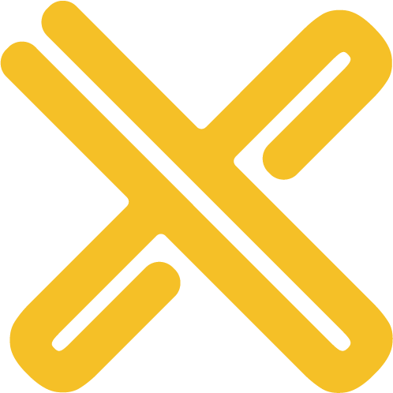
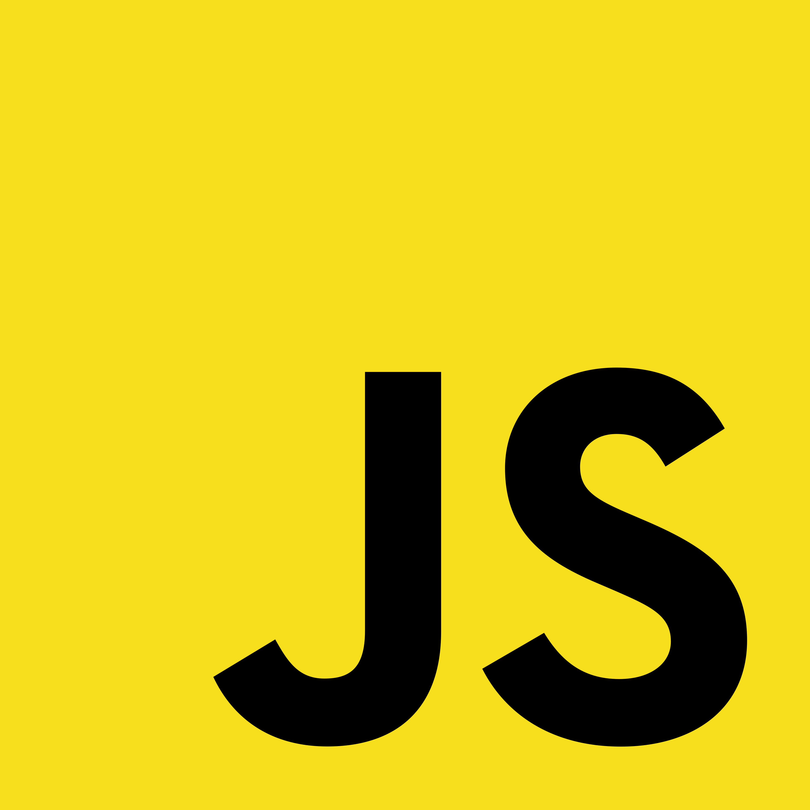
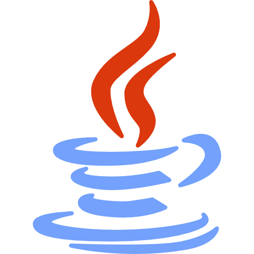

<h1 id="header" align="center">
    <pre>Hi! 👋 I'm Sami :)</pre>
  </h1>

I'm an AI/ML Engineer with a passion for [Linux](https://github.com/y0usaf/nixos) and the Linux ecosystem

 I'm currently an AI-Native Software Engineer at [CookUnity](https://cookunity.com/)! 

---

## I've worked at
 [CookUnity](https://cookunity.com/)

 [Rootly](https://rootly.com/)

 [Cohere](https://cohere.com/)

## Featured Projects
  [y0usaf/codex-desktop-flake](https://github.com/y0usaf/codex-desktop-flake) - A NixOS flake that repackages OpenAI's Codex Desktop for Linux/NixOS.

 [y0usaf/cursors](https://github.com/y0usaf/cursors) - Linux cursor themes (Super Smash Bros. Ultimate, Deepin Dark).

## I've worked on
 [Sami's Randomizer](https://github.com/y0usaf/Samis-Randomizer) - A Java utility project with custom randomization workflows.

 [Sami's AE Infinity](https://github.com/y0usaf/Samis-AE-Infinity) - A Java project focused on extending Applied Energistics automation systems.

 [y0usaf/cursors](https://github.com/y0usaf/cursors) - Linux cursor themes (Super Smash Bros. Ultimate, Deepin Dark).

  [y0usaf/codex-desktop-flake](https://github.com/y0usaf/codex-desktop-flake) - A NixOS flake that repackages OpenAI's Codex Desktop for Linux/NixOS.

## Open Source Contributions

 Contributor to [hyprwm/hyprgraphics](https://github.com/hyprwm/hyprgraphics)

 Contributor to [cjpais/Handy](https://github.com/cjpais/Handy)

 Contributor to [Piebald-AI/tweakcc](https://github.com/Piebald-AI/tweakcc)

 Contributor to [AllTheMods/All-the-mods-10-Sky](https://github.com/AllTheMods/All-the-mods-10-Sky)
